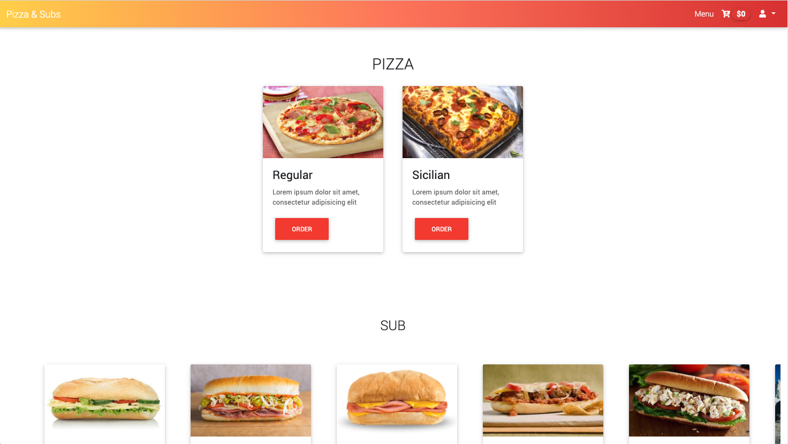

</a>

# Project 3

An ecommerce site based on Pinnochio’s Pizza & Subs. This is a project for CS50's Web Programming with Python and JavaScript course

## Usage

- Register or Login to gain access to the ordering system

- Add items in the Django admin

- Update items in the Django admin

- Remove items in the Django admin

- Virtual shopping cart with memory

- Confirm or cancel your order and even remove an item

- Site admin can view the orders palced from the website and mark it if it's already completed

### Author

- Joie Angelo T. Llantero

### Resources

- Images: freepik.com and other images taken from the internet.
- Favicon from https://gauger.io/fonticon/
- Bootstrap v4.4.1
- Material Design for Bootstrap 4
- Javascript Animation: AOS
